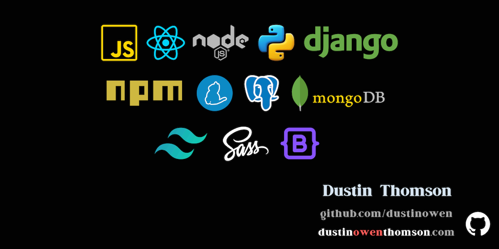

## <u>Full Stack Developer with a Passion for Customer-Centric Solutions</u>

## <a href='https://www.dustinowenthomson.com' target="_blank">Hello! I'm Dustin.</a>
I am a full-stack developer with proficiency in various programming languages and frameworks. I am actively pursuing opportunities in the software engineering field to further enhance my skills and contribute meaningfully both professionally and personally. I am eager to find a role where I can leverage my expertise to enhance internal productivity within companies and contribute to shaping technology to be more user-friendly.

### My Full-Scale Applications:

* <strong>BARK PARKS ( <a href="https://barkparks.info" target="_blank">Live Site</a> | <a href="https://github.com/dustinowen/Bark_Parks" target="_blank">GitHub</a> )</strong> 
Tech Used: Django, HTML, CSS (bootstrap)

Bark Parks is a dog park finder that enables users to discover parks in their local area or explore locations in preparation for travel. Users have the ability to save preferred parks, share photos from their visits, and leave reviews for the parks they explore.

This was my first experience leveraging Django full-stack technology! With Django, Bark Parks incorporates a robust user authentication system, ensuring the secure handling of user-generated content. Additionally, the integration of the Google API enhances the platform's capability to locate dog parks within the queried area.

Update 10.16.23 - Users can now personalize their experience by storing favorite parks directly to their individual profiles, providing a more tailored and private list of preferred locations.

<i>Bark Parks, while not currently mobile-friendly, is in the process of becoming accessible on mobile devices! </i>

* <strong>RUKE'S EMPORIUM ( <a href="https://barkparks.info" target="_blank">Live Site</a> | <a href="https://github.com/dustinowen/Bark_Parks" target="_blank">GitHub</a> )</strong> 
Tech Used: MongoDB, Express.js, React,js, Node.js

  This was my first experience with React! I conceived and built a fully functional e-commerce website from the ground up, utilizing the MERN stack to ensure seamless integration between the front-end and back-end. 

  The site provides a consistent and user-friendly experience across diverse devices and screen sizes. Furthermore, I developed a robust backend with comprehensive inventory management capabilities, empowering site owners to efficiently track and manage their product inventory.

### Mini Projects and Examples:

* <strong>ROLODEX ( <a href="https://rolodex-150c756cec8a.herokuapp.com/" target="_blank">Live Site</a> | <a href="https://github.com/dustinowen/rolodex" target="_blank">GitHub</a> )</strong> 
Tech Used: React.js

The Rolodex project is a small-scale React application showcasing the implementation of key components. To simulate a database of 100 people, I integrated the API from <a href='https://randomuser.me/'>Random User Generator</a> The application features a search function, enabling users to filter results through text input.

In this project, my focus was on the implementation of class-based functionality, demonstrating proficiency in structuring components for various elements on the page, including the search box, card container, and card content.

<!--
**dustinowen/dustinowen** is a ✨ _special_ ✨ repository because its `README.md` (this file) appears on your GitHub profile.

Here are some ideas to get you started:

- 🔭 I’m currently working on ...
- 🌱 I’m currently learning ...
- 👯 I’m looking to collaborate on ...
- 🤔 I’m looking for help with ...
- 💬 Ask me about ...
- 📫 How to reach me: ...
- 😄 Pronouns: ...
- ⚡ Fun fact: ...
-->

</body>